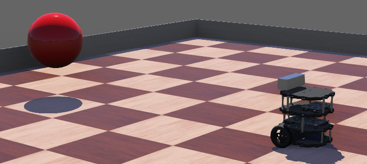

# Webots Visual Tracking Example

This example shows a robot following a red ball in Webots.
The robot uses a HSV thresholding (using OpenCV) to detect the red ball and a simple P controller to track it.

